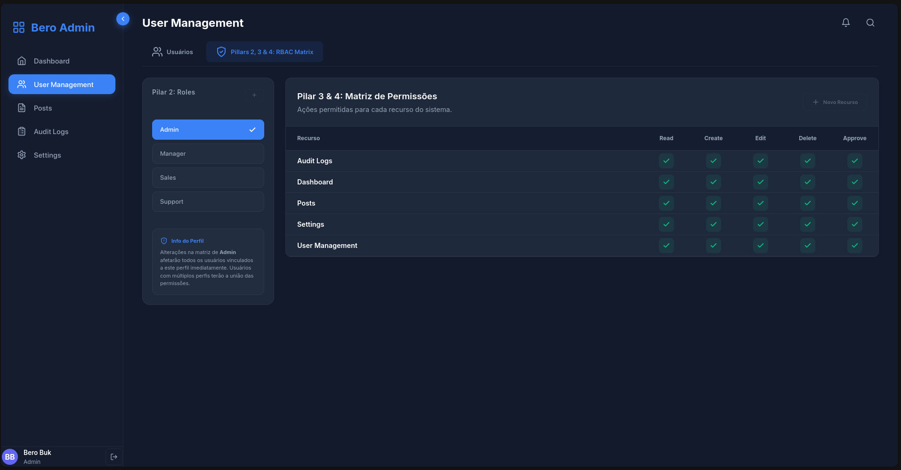

# APP - Bero Admin

A Proof of Concept (PoC) for a To-Do App using Axum, htmx, and SeaORM.



# Axum with SeaORM example app

1. Modify the `DATABASE_URL` var in `.env` to point to your chosen database

1. Turn on the appropriate database feature for your chosen db in `app/Cargo.toml` (the `"sqlx-postgres",` line)

1. Execute `cargo run` to start the server

1. Visit [localhost:8000](http://localhost:8000) in browser

Run tests:

```bash
# Run all tests (Unit + Integration)
cargo test -p axum-example-app

# Run specific integration tests
cargo test -p axum-example-app --test auth_tests
cargo test -p axum-example-app --test users_tests
```

Run migration:

```bash
cargo run -p migration -- up
```

Regenerate entity: Auto-generated, do not modify the entity folder.

```bash
sea-orm-cli generate entity --output-dir ./entity/src --lib --entity-format dense --with-serde both
```

## Configuration (Environment Variables)

| Variable | Description | Default |
|----------|-------------|---------|
| `ENABLE_FILE_LOGGING` | Enable rolling file logging in `logs/*.log` | `false` |
| `SQLX_LOGGING` | Enable SQLx query logging | `false` |
| `SQLX_LOG_LEVEL` | Level for SQLx logs (`info`, `debug`, `error`, etc) | `info` |

## Docker

### Prerequisites

- [Docker](https://docs.docker.com/get-docker/) and [Docker Compose](https://docs.docker.com/compose/install/) installed

### Services

| Service | Image | Port | Description |
|---------|-------|------|-------------|
| **database** | `postgres:latest` | `5432` | PostgreSQL database |
| **redis** | `redis:latest` | `6379` | Redis cache with AOF persistence |
| **pgadmin** | `dpage/pgadmin4:latest` | `5050` | Database management UI |
| **minio** | `minio/minio:latest` | `9000` / `9001` | Object storage (API / Console) |
| **axum** | `bci-base:16.0` | `8000` | Application server (release binary) |

### Running (Development - Infrastructure Only)

Start only the infrastructure services (database, redis, pgadmin, minio) and run the app locally:

```bash
# Start infrastructure services
docker compose up -d database redis pgadmin minio

# Run migrations
cargo run -p migration -- up

# Start the app locally
cargo run -p axum-example-app
```

### Running (Full Stack with Docker)

Run everything inside Docker, including the application:

```bash
# Build the release binary first
cargo build --release

# Start all services
docker compose up -d
```

> The `axum` service uses `.env` and expects the release binary at `./target/release/axum-example-brittos`.

### Default Credentials

| Service | User | Password |
|---------|------|----------|
| PostgreSQL | `root` | `root` |
| pgAdmin | `admin@admin.com` | `admin123` |
| MinIO | `minioadmin` | `minioadmin` |

### Useful Commands

```bash
# Stop all services
docker compose down

# Stop and remove volumes (reset all data)
docker compose down -v

# View logs
docker compose logs -f

# View logs for a specific service
docker compose logs -f database

# Restart a specific service
docker compose restart redis
```
